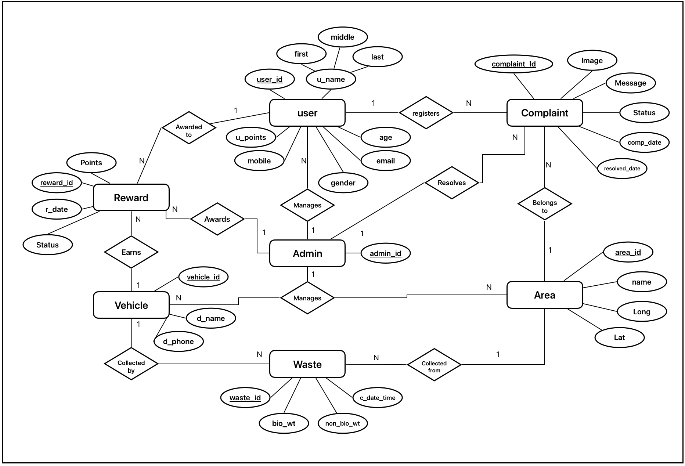
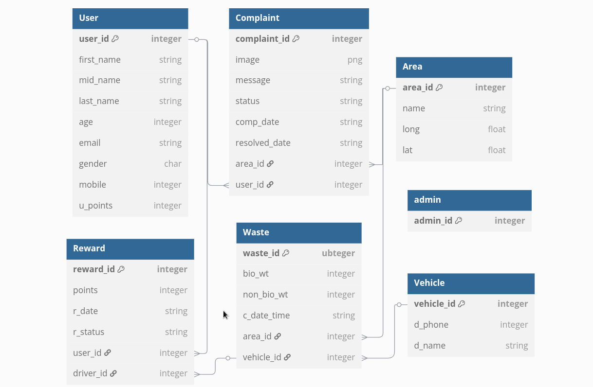

# EcoCollect - Waste Management System

EcoCollect is a comprehensive waste management platform designed to streamline waste collection, tracking, and incentivize proper waste segregation through a rewards system.


## Academic Project Information

This project was developed as part of the 5th semester Database Management Systems (DBMS) course at University Visvesvaraya College of Engineering (UVCE), Bengaluru.

## Overview

EcoCollect enables residents, waste collection vehicle drivers, and administrators to work together for efficient waste management in communities. The system tracks waste collection, segregation quality, and rewards users for good waste management practices.

## Features

- **User Management**: Registration and authentication system for residents, drivers, and administrators
- **Waste Collection Tracking**: Record and monitor waste collection data
- **Reward System**: Points-based incentives for proper waste segregation
- **Vehicle Management**: Track collection vehicles and optimize routes
- **Complaint System**: Allow users to register waste management issues
- **Administrative Dashboard**: Monitor system performance and manage users

## Entity Relationship Diagram

The following ERD shows the database structure:



## Relational Schema

The following Relational Schema shows the database structure:



## Database Schema

The database includes several key tables:

- Users (residents, drivers, administrators)
- Waste (collection records with biodegradable and non-biodegradable weights)
- Vehicles (collection fleet management)
- Rewards (point tracking for proper waste segregation)
- Areas (geographic locations for collection planning)
- Complaints (issue tracking system)

## Technology Stack

- **Backend**: Python with Flask
- **Database**: SQLite (WasteManagement.db)
- **Frontend**: HTML, CSS, JavaScript
- **Authentication**: Session-based auth system

## Getting Started

### Prerequisites

```bash
pip install -r requirements.txt
```

### Running the Application

1. Start the Flask server:

```shell
cd backend
python app.py
```

2. Access the application at `http://localhost:5000`

## User Roles

- **Residents**: Register, segregate waste, track collections, earn rewards
- **Drivers**: Log collections, record waste quality, manage routes
- **Administrators**: Oversee system, manage users, analyze waste data
